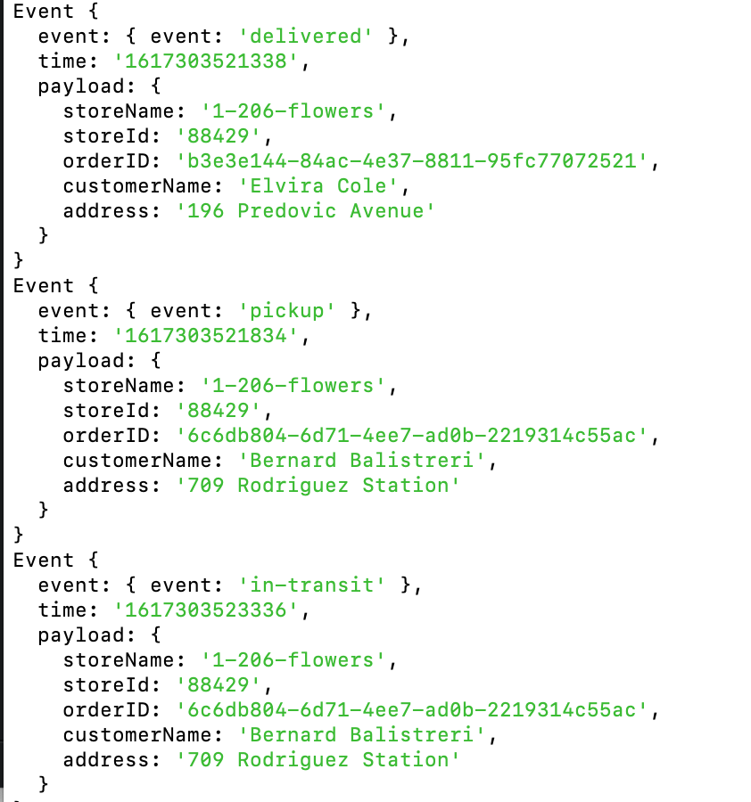

# Code Academy Parcel Service (CAPS): Event Driven Parcel Delivery Management System
Socket.io event driven app that represents live tracking of a parcel delivery service; the CAPS app is the socket server that manages communication between vendors and drivers.

The CAPS server also holds a queue that stores undelivered pickups and deliveries to make sure that messages are ultimately delivered to the proper destination. 

**Pickups** are added to an internal queue awaiting confirmation that they have been accepted by a driver. The pickup queue is not specific to any store or driver, all pickups from any vendor are added to the queue in order of receipt. Any driver logging onto the system will be notified of all packages awaiting pickup. Pickups are only removed from the queue when CAPS receives an in transit confirmation from a driver.

**Delivery and in-transit notices** are also queued in the CAPS storage into separate queues that are indexed by the store name. Stores only save missed messages that are related to deliveries from their own store. When stores login to the system, they request an update on any missed notifications. They will receive a summary of deliveries to their store from their internal queue. Messages are only deleted from the delivery queue upon confirmation from the vendor that their delivery was received.

**Client Apps**

**[Vendors](https://github.com/AnneThor/caps-vendor/blob/main/README.md)**

**[Drivers](https://github.com/AnneThor/caps-driver/blob/main/README.md)**

**[Express Post Route for Pickups](https://github.com/AnneThor/caps-express/blob/main/README.md)**

## Author: Anne Thorsteinson

**[Tests](https://github.com/AnneThor/caps-socketio/actions)**

## Setup

```.env``` requirements:

- ```PORT```
- ```STORE_NAME```: the name of the store currently operating

## Running the App

- ```npm start```: this will run the app in the console, app will log the events coming in from vendor and driver client apps

- When a pickup event is sent from a vendor, the app will broadcast to the system, and a driver will respond when it is picked up. Internally, CAPS holds a queue of pickup messages. Every pickup message from all vendors is added to queue in order of receipt. Messages are only deleted from the pickup queue when a confirmation notice is received from a driver. At this point the messages are enqueued to an "intransit" queue that is keyed by the store the package comes from.
- In transit and delivered messages are emitted from the driver app and handled by the CAPS system, which routes only to the interested vendor (the vendor whose package is being delivered). All in transit and delivery messages are added to the "in-transit" or "delivered" queue keyed by their store name. In transit messages are only deleted upon receipt of "delivered" message from the driver, they they are moved to the "delivered" queue of their corresponding store. Delivered messages are only deleted from the "delivered" queue of their store key when CAPS received a confirmation back from the store that they have received the delivery notice.
- The CAPS app prints a log of all transactions to the console 




### Endpoints:

The app runs from the ```/caps``` namespace

## Tests

- Unit Tests: ```npm run test``` testing is complete for listener functions
- Lint Tests: ```npm run lint```

## UML Diagram - Current Version with Internal Storage


## UML Diagram - Old Version with No Storage


